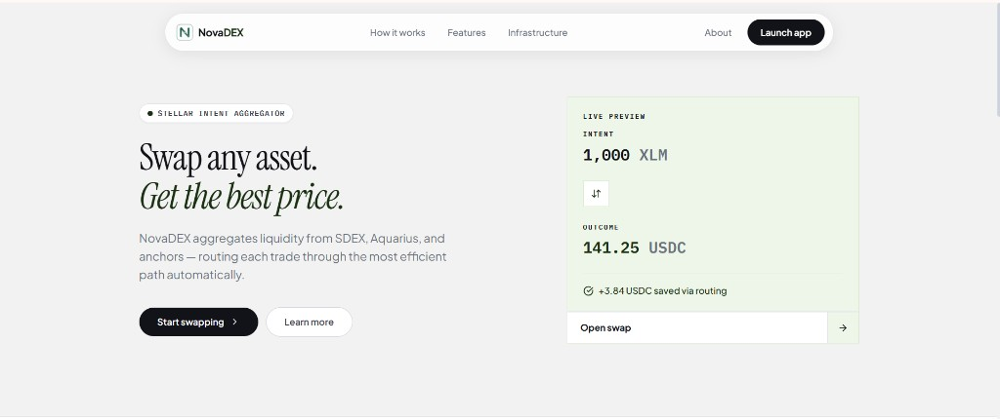
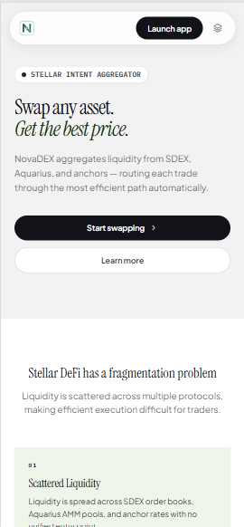
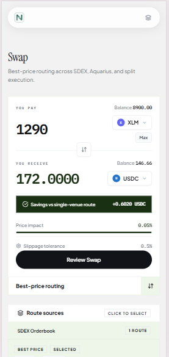
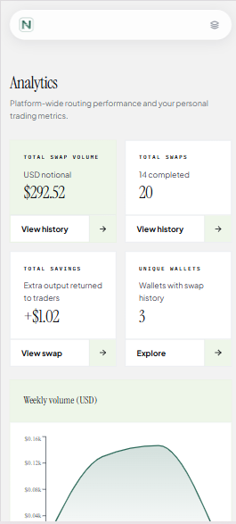

<div align="center">

# ◆ NovaDEX

**Intent-based DEX aggregator on Stellar**

Smart routing · Best execution · On-chain settlement

[](https://nextjs.org)
[](https://stellar.org)
[](https://soroban.stellar.org)
[](https://supabase.com)
[](https://github.com/anuraggdubey/NovaDex/actions/workflows/ci.yml)

</div>

---

## What is NovaDEX?

NovaDEX finds the **optimal swap route** across Stellar's liquidity sources (SDEX, Aquarius AMM pools) and executes it through a single atomic transaction — Soroban router attestation, path-payment liquidity, and on-chain savings proof.

---

## Submission Checklist

| Requirement | Details |
|-------------|---------|
| **Public GitHub repository** | [github.com/anuraggdubey/NovaDex](https://github.com/anuraggdubey/NovaDex) |
| **README with complete documentation** | This file — setup, architecture, contracts, API, screenshots, proof |
| **Live demo link** | https://novaxdex-app.vercel.app |
| **Contract deployment address** | Testnet Soroban IDs in [Deployed Contracts](#deployed-contracts-stellar-testnet) |
| **Product UI screenshots** | [Screenshots](#screenshots) below |
| **Mobile responsive design** | Mobile views in [Screenshots](#screenshots) |
| **Analytics / monitoring setup** | Analytics dashboard + Supabase-backed global stats |
| **Demo video link** | _Add your Loom / YouTube URL below_ |
| **10+ user wallet address proof with feedback sheet** | [User feedback form](https://forms.gle/cVSUxiUNDhT6NTjW8) · [Feedback responses sheet](https://docs.google.com/spreadsheets/d/1qq6sHBSlt3gTw6xGoiXBCnT-gp_jiXNI5XpwNtn1bWU/edit?resourcekey=&gid=1713052659#gid=1713052659) |

---

## Live Demo & Submission Proof

| Resource | Link |
|----------|------|
| **Live App** | _TODO: `https://novaxdex-app.vercel.app`_ |
| **Demo Video** | _TODO: `https://www.loom.com/share/your-video-id` or `https://youtu.be/your-video-id`_ |
| **Repository** | [github.com/anuraggdubey/NovaDex](https://github.com/anuraggdubey/NovaDex) |
| **User Feedback Form** | [forms.gle/cVSUxiUNDhT6NTjW8](https://forms.gle/cVSUxiUNDhT6NTjW8) |
| **Feedback Responses Sheet** | [Google Sheets](https://docs.google.com/spreadsheets/d/1qq6sHBSlt3gTw6xGoiXBCnT-gp_jiXNI5XpwNtn1bWU/edit?resourcekey=&gid=1713052659#gid=1713052659) |
| **Twitter / X** | [@anuraggdubeyy](https://x.com/anuraggdubeyy) |

### Proof of 10+ User Wallet Interactions

_WIP — replace with your live proof before final submission._

| Metric | Value | Source |
|--------|-------|--------|
| Unique wallets (on-chain swaps recorded) | _TODO: e.g. 3+_ | NovaDEX Analytics page / `global_stats.unique_wallets` |
| Total completed swaps | _TODO: e.g. 14+_ | Analytics dashboard / Supabase `swaps` table |
| Stellar Expert tx links | _TODO: paste 2–3 example tx hashes_ | [Stellar Expert Testnet](https://stellar.expert/explorer/testnet) |


## Screenshots

### Product UI (Desktop)



### Mobile Responsive Design

<p align="center">
  
  <br /><br />
  
  <br /><br />
  
</p>

### Analytics & Monitoring

Platform-wide volume, swap count, savings, and unique wallets — backed by Supabase and the `/api/analytics/global` endpoint.

---

## Deployed Contracts (Stellar Testnet)

Redeployed **2026-07-02** with `attest_swap` (router) and `record_savings_user` (oracle).

| Contract | ID | Explorer |
|----------|-----|----------|
| **Aggregator Router** | `CDUBGNAQCVTCPNRE3AUVFYPYE6UWFBVHPGX4BRBDGFNWBV7WERNC3Q7U` | [Stellar Expert](https://stellar.expert/explorer/testnet/contract/CDUBGNAQCVTCPNRE3AUVFYPYE6UWFBVHPGX4BRBDGFNWBV7WERNC3Q7U) |
| **Price Oracle** | `CBPPZGP6ER3EGT5LIJNOWQE3QYRNFH5FRCT4ZHB2D6RPXV5SEV2H2RLK` | [Stellar Expert](https://stellar.expert/explorer/testnet/contract/CBPPZGP6ER3EGT5LIJNOWQE3QYRNFH5FRCT4ZHB2D6RPXV5SEV2H2RLK) |

- **Network:** Stellar Testnet  
- **Protocol fee:** 10 bps (0.1%)  
- **Admin:** `GBOOE7MNH34TFXUJFY5B2IFUTKKJSSH77JDPA3HTHWLGKGIOCOVHPPW5`

---

## Real-World Utility (The "Binance Example")

How does swapping tokens on a DEX actually translate to real money?

If a user wants to cash out their crypto, they can use NovaDEX on Mainnet to swap their volatile `XLM` into `USDC` at the absolute best market rate. Because Binance natively supports Stellar USDC deposits, the user can instantly transfer that USDC from their Freighter wallet directly to Binance (settling in < 5 seconds for a fraction of a penny), and then withdraw it to their bank account as US Dollars.

👉 **[Read the full Real-World Workflow & Binance Example here](working.md)**

---

## Features

- **Multi-source routing** — SDEX order books, Aquarius AMM, split execution (65/35)
- **Wallet support** — Freighter + Albedo (connect, sign swaps, sign auth for private APIs)
- **Soroban integration** — Router quote simulation; contracts deployed on testnet
- **Savings proof** — Compares aggregated route vs single-venue; records savings in Supabase
- **Analytics** — Global volume, swap count, savings, unique wallets, weekly charts
- **History** — Per-wallet swap history with signature-based API auth
- **Non-custodial** — Users sign all transactions in their own wallet

---

## Tech Stack

| Layer | Technology |
|-------|-----------|
| Frontend | Next.js 14 · React 18 · Tailwind CSS · Framer Motion |
| State | Zustand stores (wallet, swap, toast, data) |
| Wallets | Freighter · Albedo |
| Backend | Next.js API routes · Supabase (Postgres) |
| Contracts | Soroban (Rust) — Aggregator Router + Price Oracle |
| Network | Stellar Testnet (mainnet-ready) |

---

## Architecture

```
User (Freighter / Albedo)
        │
        ▼
┌───────────────────┐     ┌─────────────────┐     ┌──────────────────┐
│  Next.js client   │────▶│  API routes     │────▶│  Supabase        │
│  (client-app)     │     │  /api/swaps     │     │  swaps, users,   │
└─────────┬─────────┘     │  /api/analytics │     │  global_stats    │
          │               └─────────────────┘     └──────────────────┘
          │ sign tx
          ▼
┌───────────────────┐     ┌─────────────────┐
│  Stellar Horizon  │     │  Soroban RPC    │
│  path payments    │     │  router quote   │
└───────────────────┘     └─────────────────┘
```

---

## Project Structure

```
src/
├── app/              → Pages, layouts, API routes
│   └── client-app.tsx → Main application shell
├── components/       → Reusable UI (logo, etc.)
├── lib/              → Stellar SDK, routing engine, Supabase client
├── store/            → Zustand stores
└── types/            → TypeScript interfaces

contracts/
├── aggregator_router/ → Soroban swap router contract
└── price_oracle/      → On-chain price feed contract

docs/
└── screenshots/       → README / submission screenshots

supabase/
└── schema.sql         → Database schema
```

---

## Quick Start

```bash
# 1. Install dependencies
npm install

# 2. Configure environment
cp .env.example .env.local
# Fill in your Supabase keys (never commit .env.local)

# 3. Run Supabase schema
# Paste supabase/schema.sql in Supabase SQL Editor

# 4. Start dev server (clean cache if chunks 404)
npm run dev:clean
```

Open **http://localhost:3000**

---

## Environment Variables

| Variable | Description |
|----------|-------------|
| `NEXT_PUBLIC_STELLAR_NETWORK` | `testnet` or `mainnet` |
| `NEXT_PUBLIC_HORIZON_URL` | Horizon API endpoint |
| `NEXT_PUBLIC_SUPABASE_URL` | Supabase project URL |
| `NEXT_PUBLIC_SUPABASE_ANON_KEY` | Supabase anon/public key |
| `SUPABASE_SERVICE_ROLE_KEY` | Supabase service role key (**secret — server only**) |
| `NEXT_PUBLIC_AGGREGATOR_CONTRACT_ID` | Deployed router contract ID |
| `NEXT_PUBLIC_ORACLE_CONTRACT_ID` | Deployed oracle contract ID |
| `NEXT_PUBLIC_TESTNET_ISSUER` | Testnet token issuer (testnet only) |
| `NEXT_PUBLIC_APP_URL` | Public app URL (for deployment) |

> See [`.env.example`](.env.example) for the full template. **Never commit `.env.local`** — it contains Supabase service keys.

---

## API Routes

| Route | Method | Auth | Description |
|-------|--------|------|-------------|
| `/api/users/connect` | POST | — | Register / upsert wallet on connect |
| `/api/users/[pubkey]/history` | GET | Wallet signature | User swap history |
| `/api/users/[pubkey]/analytics` | GET | Wallet signature | Personal analytics |
| `/api/users/[pubkey]/profile` | GET | Wallet signature | User profile |
| `/api/swaps/record` | POST | — | Record completed swap |
| `/api/analytics/global` | GET | — | Platform-wide stats + charts |
| `/api/analytics/pairs` | GET | — | Top trading pairs |
| `/api/pools` | GET | — | Pool liquidity data |
| `/api/auth/verify` | POST | — | Verify wallet auth signature |

---

## Contracts

Soroban smart contracts in `contracts/` (Rust workspace):

- **`aggregator_router`** — Route quotes, `attest_swap` on-chain settlement attestation, split swap logic
- **`price_oracle`** — Price checkpoints and `record_savings_user` on-chain savings proof

Build and redeploy:

```bash
cd contracts
stellar contract build
# See DEPLOYMENT_GUIDE.md (local) for full deploy + initialize steps
```

---

## Scripts

```bash
npm run dev         # Dev server
npm run dev:clean   # Delete .next cache, then dev (use if static 404s)
npm run build       # Production build
npm run build:clean # Clean + production build
npm run clean       # Remove .next cache only
npm run lint        # ESLint
npm run typecheck   # TypeScript check
```

---

## Deployment (Vercel)

1. Push `main` to GitHub  
2. Import repo in [Vercel](https://vercel.com)  
3. Add all variables from `.env.example` (secrets in dashboard only)  
4. Deploy — set **Live App** URL in this README  

---

## License & Attribution

Built for the **Stellar ecosystem** · Stellar Hackathon 2026

---

<div align="center">
<sub>Built for the Stellar ecosystem ◆ Stellar Hackathon 2026</sub>
</div>
